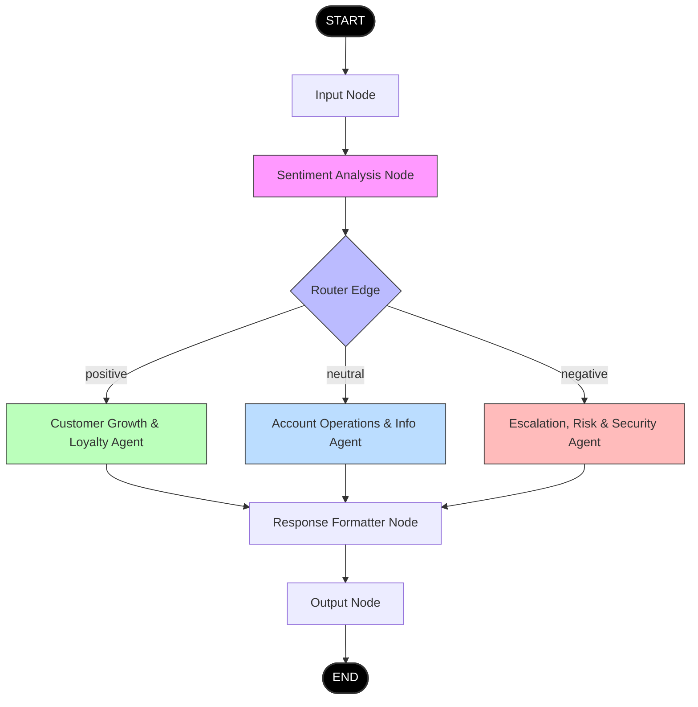

# ApexBank Sentiment-Routing Support Hub (LangGraph + React)

A production-grade customer support routing agent pipeline for **ApexBank** (a digital bank) built with **FastAPI**, **LangGraph**, **LangSmith**, and **React + TypeScript + Tailwind CSS**. 

The system automatically analyzes the sentiment of incoming banking queries and dynamically routes them to specialized bank representatives (Growth & Loyalty, Account Operations, and Risk & Security).

---

## 1. High-Level Architecture Overview

The application is structured around a **LangGraph StateGraph** that manages conversation state, routes queries based on sentiment analysis, generates response actions, and returns structured data to a responsive React front-end.

```
┌─────────────────┐      ┌────────────────────────┐      ┌─────────────────────────┐
│  React Frontend │ ───> │ FastAPI Backend Server │ ───> │ LangGraph Workflow      │
│  (Vite + TS)    │ <─── │ (Uvicorn /api/chat)    │ <─── │ Sentiment Router Engine │
└─────────────────┘      └────────────────────────┘      └─────────────────────────┘
                                                              │
                                                              ▼
                                                 ┌─────────────────────────┐
                                                 │ LangSmith observability │
                                                 │   (Execution Tracing)   │
                                                 └─────────────────────────┘
```

---

## 2. Folder Structure

```
.
├── backend/
│   ├── app.py                # FastAPI endpoints, CORS setup, Server entry
│   ├── config.py             # Environment configurations, Logging, Mock Mode detection
│   ├── graph.py              # LangGraph StateGraph & Routing configuration
│   ├── nodes.py              # Node implementations (Sentiment analysis, Agents, Formatter)
│   ├── state.py              # Schema for GraphState
│   └── requirements.txt      # Python dependencies
├── frontend/
│   ├── src/
│   │   ├── components/
│   │   │   └── GraphVisualizer.tsx  # Dynamic node status & execution path renderer
│   │   ├── App.css                  # Overridden stylesheets
│   │   ├── App.tsx                  # Main customer-facing dashboard and state
│   │   ├── index.css                # Tailwind entry, custom scrollbars, glassmorphic styles
│   │   └── main.tsx                 # React DOM bootstrapper
│   ├── index.html            # Entry HTML & SEO headers
│   ├── tailwind.config.js    # Tailwind configuration (themes, custom animations)
│   ├── postcss.config.js     # PostCSS configuration
│   ├── vite.config.ts        # Vite configuration
│   └── package.json          # React dependencies
├── .env.example              # Env template
└── README.md                 # Project documentation
```

---

## 3. LangGraph Workflow Diagram

Our graph consists of **7 execution nodes** linked together inside the compiled state workflow:



1. **Input Node**: Captures user input query, resets active metadata logs, and sanitizes states.
2. **Sentiment Analysis Node**: Invokes LLM (or mock heuristic) to classify query sentiment into `positive`, `neutral`, or `negative`.
3. **Router Node**: Conditional routing edge that forwards the state to the selected agent based on sentiment.
4. **Agent Nodes (Specialized)**:
   - **Customer Growth & Loyalty Agent** (Positive tone, promotes premium Gold upgrades)
   - **Account Operations & Info Agent** (Analytical, gives precise ACH routing numbers and wire fees)
   - **Escalation, Risk & Security Agent** (Highly empathetic, guides on locking cards, disputes, and safety)
5. **Response Formatter**: Polishes raw agent answers into clean client-ready Markdown.
6. **Output Node**: Commits results to persistent chat logs and outputs to front-end.

---

## 4. Environment Configuration

Copy the example configuration to a local `.env` file in the root directory:

```bash
cp .env.example .env
```

### Configurable Keys:
- `OPENAI_API_KEY`: Required for live OpenAI LLM calls. If left empty or using the placeholder, the system runs in **Simulated Mock Mode** using keyword heuristics.
- `LANGCHAIN_API_KEY`: Active LangSmith API key for workspace tracing.
- `LANGCHAIN_PROJECT`: The project name in your LangSmith dashboard (defaults to `langgraph-sentiment-router`).
- `LANGCHAIN_TRACING_V2`: Set to `true` to enable automatic execution tracing.

---

## 5. LangSmith Configuration & Observability

To monitor your nodes in real time, set up LangSmith tracing:

1. Create a free account at [Smith LangChain](https://smith.langchain.com/).
2. Create an API Key in **Personal Settings** -> **API Keys**.
3. Add the key to your `.env` file:
   ```env
   LANGCHAIN_API_KEY=lsv2_pt_...
   LANGCHAIN_TRACING_V2=true
   LANGCHAIN_PROJECT=langgraph-sentiment-router
   ```
4. Start your FastAPI server. Any request made to `/api/chat` will automatically generate complete execution runs in the LangSmith dashboard, illustrating:
   - Token usage
   - Latency for each LLM query
   - Executed node order and state values before/after transition
   - Step-by-step conditional branch outputs

---

## 6. Running the Application

### Option A: Local Manual Launch

#### Prerequisite: Python 3.10+ & Node.js 18+

#### 1. Setup Backend
```bash
# Navigate to backend and install requirements
cd backend
pip install -r requirements.txt

# Run FastAPI Server
python app.py
```
*Backend runs on `http://localhost:8000`.*

#### 2. Setup Frontend
```bash
# Navigate to frontend and install modules
cd ../frontend
npm install

# Start Local Dev Server
npm run dev
```
*Frontend runs on `http://localhost:5173`.*

---

## 7. Example User Queries

Use these test cases to verify the routing branches (accessible as quick-clicking pills in the React console):

| Sentiment | Sample Input | Expected Active Agent | Key Response Behavior |
| :--- | :--- | :--- | :--- |
| **Positive** | *"I love your new investment tools! How can I upgrade to a gold account?"* | Customer Growth & Loyalty Agent | Match enthusiasm; highlight premium APY & rewards. |
| **Neutral** | *"What are your routing numbers for standard ACH transfers and wires?"* | Account Operations Agent | Objective list; provide exact ACH & wire routing codes. |
| **Negative** | *"Help! There is an unauthorized charge of $120 on my card and I lost it!"* | Escalation, Risk & Security Agent | Reassure safety; outline immediate card lock & dispute steps. |

---

## 8. Deployment Recommendations

### Docker Orchestration (Recommended)
You can dockerize both apps and run them via a standard compose stack:

1. **Backend Dockerfile** (`backend/Dockerfile`):
   ```dockerfile
   FROM python:3.11-slim
   WORKDIR /app
   COPY requirements.txt .
   RUN pip install --no-cache-dir -r requirements.txt
   COPY . .
   EXPOSE 8000
   CMD ["uvicorn", "app:app", "--host", "0.0.0.0", "--port", "8000"]
   ```

2. **Frontend Dockerfile** (`frontend/Dockerfile`):
   ```dockerfile
   FROM node:18-alpine AS builder
   WORKDIR /app
   COPY package*.json ./
   RUN npm install
   COPY . .
   RUN npm run build

   FROM nginx:alpine
   COPY --from=builder /app/dist /usr/share/nginx/html
   EXPOSE 80
   CMD ["nginx", "-g", "daemon off;"]
   ```

3. **Docker Compose Setup**: Or spin up on platforms like **Render**, **Railway**, or **Fly.io** directly using code repos and mapping environment variables.
